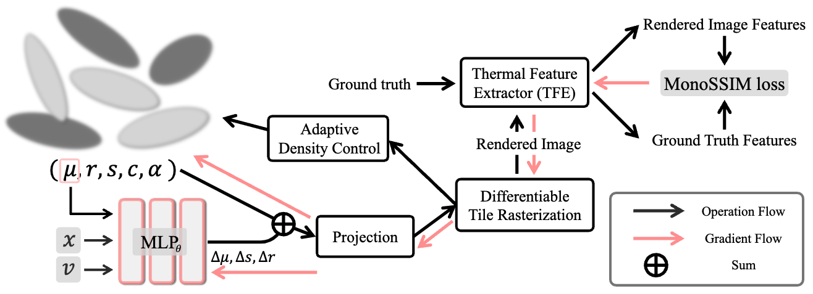
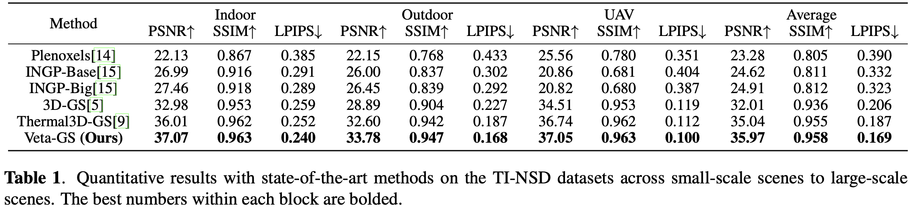
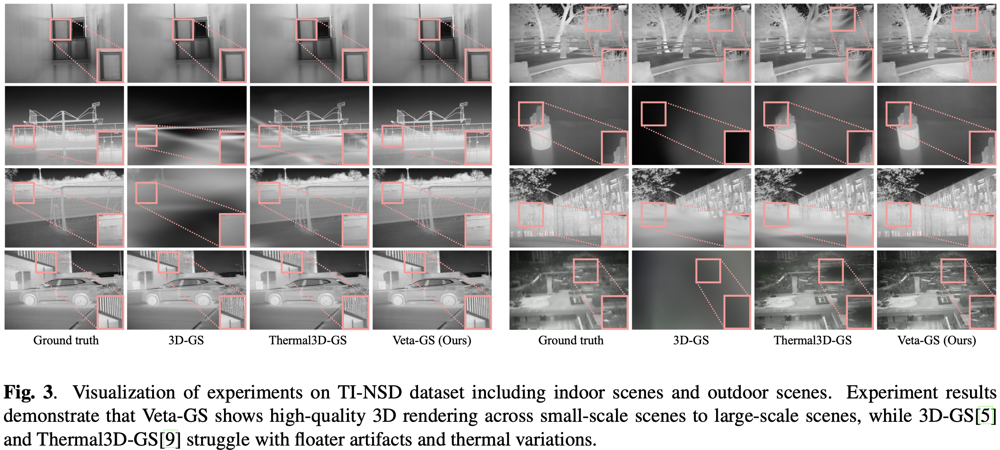

# View-dependent deformable 3D Gaussian Splatting for thermal infrared Novel-view Synthesis

## [Project page](https://nbril0313.github.io/Veta-GS/) | [Paper](https://arxiv.org/pdf/2505.19138)

## Pipeline


This repository contains the official implementation associated with the paper "View-dependent deformable 3D Gaussian Splatting for thermal infrared Novel-view Synthesis".


## Dataset

In our paper, we use:

- TI-NSD dataset from [TI-NSD](https://github.com/mzzcdf/Thermal3DGS)

We organize the datasets as follows:

```shell
├── data
│   | TI-NSD 
│     ├── apples
│     ├── basketball_court 
│     ├── ...
```


## Run

### Environment

```shell
git clone https://github.com/nbril0313/Veta-GS_View-dependent-Deformable-3D-Gaussians.git --recursive
cd Veta-GS_View-dependent-Deformable-3D-Gaussians

conda create -n veta python=3.7
conda activate veta

# install pytorch
pip install torch==1.13.1+cu116 torchvision==0.14.1+cu116 --extra-index-url https://download.pytorch.org/whl/cu116

# install dependencies
pip install -r requirements.txt
```


### Train

**TI-NSD:**

```shell
python train.py -s path/to/your/TI-NSD/scene_name --eval 
```


### Render & Evaluation

```shell
python render.py -m output/exp-name 
python metrics.py -m output/exp-name
```


## Results

### TI-NSD Dataset

**Quantitative Results**



**Qualitative Results**




## Acknowledgments
This work was supported by both Institute of Information & communications Technology Planning & Evaluation
(IITP) under the Artificial Intelligence Convergence Innovation Human Resources Development (IITP-2025-RS-2023-00255968) grant funded by the Korea government(MSIT) and 'Convergence and Open Sharing System Project' granted by the Ministry of Education and National Research Foundation of Korea.

